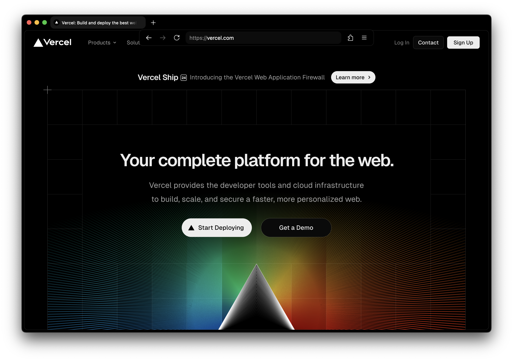

# firefox-clean

Finally, an actually functional and clean browser configuration.

Image above showcasing [Tabliss](https://tabliss.io/).
Also plays nice with the [Adaptive Tab Bar Color](https://addons.mozilla.org/en-US/firefox/addon/adaptive-tab-bar-colour/) extension.

# credits

Based in large part on https://github.com/RemyIsCool/AnimatedFox.
